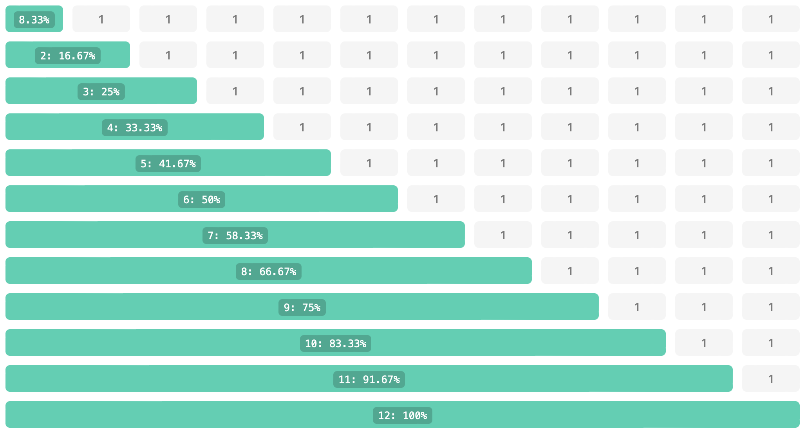

# Flexbox System basierend auf den Bootstrap CSS-Klassen

Dieses Bundle erweitert Contao um Content-Elemente zum Erzeugen von Flexbox Layouts auf Basis von Booststrap-Klassen [Bootstrap 5](https://getbootstrap.com). Durch ein öffnendes Element wird ein Layout gestartet und die Spalten Konfiguriert. Alle Content-Elemente innerhalb des Layouts werden dann in ein DIV verpackt und mit den entsprechenden CSS-Klassen ausgegeben.

**Im Seitenlayout muss das JavaScript-Template js_flexbox aktiviert werden (dient nur dazu das CSS-Framework zuladen, beinhaltet kein JavScript), alternativ kann das Bootstrap Framework geladen werden.**

## Dokumentation

### Wert 1 Sichtbarkeit (optional)

**h/hidden:**		Blendet eine Zelle aus.  
**s/show:**		Blendet die Zelle ein.

```
Breakpoint XL:	4:4:4:h 		letzte Zelle wird ausgelbendet
Breakpoint XXL:	3:3:3:3:s,3 	letzte Zelle wird wieder eingeblendet
```

### Wert 2 Breite

**a/auto:**		Breite der Zelle richtet sich nach dessen Inhalt.  
**n/none:**		Ohne Breiten Angabe, alle Zellen in einer Zeile sind gleich breit.  
**1-12:**			Breite der Zelle über Anzahl der 12 Spalten.

### Wert 3 Versatz (optional)

**0-12:**			Versatz vor der Zelle über Anzahl der 12 Spalten.  
**leer:**			Lassen Sie diesen Wert leer um keinen Versatz zu erzeugen.

```
Breakpoint MD:	8,2		alle Zellen werden mittig ein drittel der Breite angezeigt  
Breakpoint XL:	6		alle Zellen werden nebeneinander angezeigt
```

### Wert 4 Position (optional)

**f/first:**		Positioniert die Zelle an den Anfang.  
**l/last:**		Positioniert die Zelle an das Ende.  
**0-5:**			Positioniert die Zelle an die angegeben Position.

```
Breakpoint MD:	6,,1:6,,2:6,,4:6,,3		die dritte und vierte Zelle werden vertauscht  
Breakpoint XL:	3,,0					die Zellen sind wieder in der normalen Reihenfolge
```

### Breite der Spalten:


