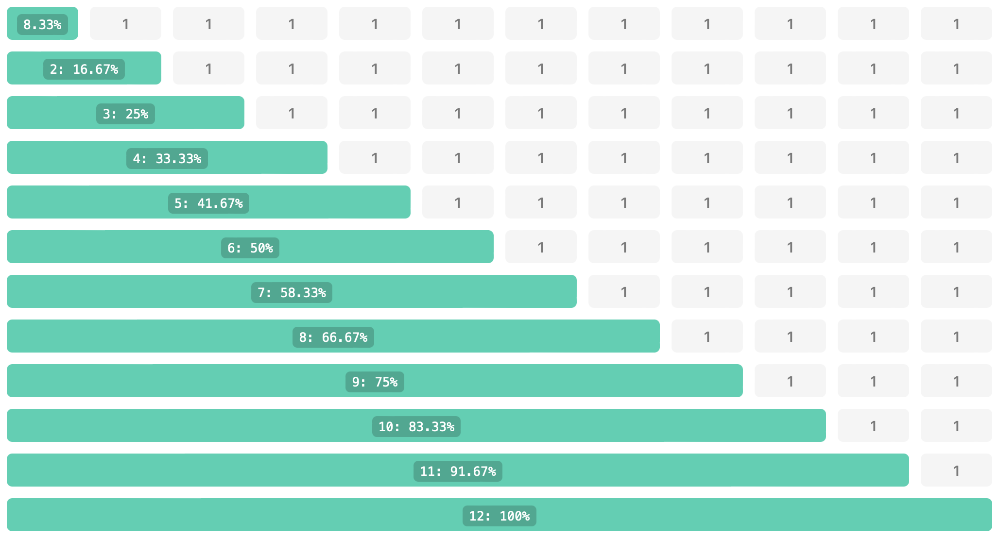

# Flexbox-/Grid-Layout System (kompatibel mit Bootstrap)

> [!NOTE]
> In Version 3.2 wurden die alten Legacy-Elemente entfernt.

Dieses Bundle erweitert Contao um Content-Elemente zum Erzeugen von Flexbox Layouts auf Basis von Bootstrap-Klassen [Bootstrap 5](https://getbootstrap.com). Durch ein öffnendes Element wird ein Layout gestartet und die Spalten konfiguriert. Alle Content-Elemente innerhalb des Layouts werden dann in ein DIV verpackt und mit den entsprechenden CSS-Klassen ausgegeben.

**Im Seitenlayout muss das JavaScript-Template js_flex aktiviert werden (dient nur dazu das CSS-Framework zu laden, beinhaltet kein JavaScript), alternativ kann das Bootstrap Framework geladen werden.**

## Framework-Modus

Über das Feld **Framework** wird gesteuert, welche CSS-Klassen generiert werden:

- **0 – ohne Framework:** Eigene `.cell`-Klassen (`cell`, `cell-1`, `cell-2`, …). Kein Bootstrap notwendig.
- **1 – Flexbox (Bootstrap):** Bootstrap-Klassen wie `.col-*`, `.offset-*`. Dokumentiert im Abschnitt „Flex-Layout".
- **2 – Grid:** Bootstrap-Grid-Klassen wie `.col-*`, `.row-*`. Dokumentiert im Abschnitt „Grid-Layout".

## Container-Optionen

| Feld | Beschreibung |
|---|---|
| **Ausrichtung horizontal** | Setzt `justify-content-*` auf dem Container (`start`, `end`, `center`, `around`, `between`, `evenly`) |
| **Ausrichtung vertikal** | Setzt `align-items-*` auf dem Container (`start`, `end`, `center`, `baseline`, `stretch`) |
| **Spaltenabstand** | Setzt `gx-*` (horizontal, Bootstrap `g-0` bis `g-5`) |
| **Zeilenabstand** | Setzt `gy-*` (vertikal, Bootstrap `g-0` bis `g-5`) |
| **Container Klassen** | Beliebige zusätzliche CSS-Klassen für den Container-DIV |

## Spalten-Optionen

| Feld | Beschreibung |
|---|---|
| **Spalten Klassen** | Eigene CSS-Klassen je Spalte, Syntax identisch zu den Breakpoint-Feldern: Zellen durch `:` getrennt, mehrere Klassen pro Zelle durch `,` getrennt |
| **Wiederholen** | Wiederholt das Segmentierungsmuster, wenn mehr Kindelemente vorhanden sind als Zellen definiert wurden |

## Dokumentation Flex-Layout

### 1. Stelle: Sichtbarkeit (optional)

- **h, hide, hidden:** Blendet eine Zelle aus.
- **s, show:** Blendet die Zelle ein.

```
 XL: 4:4:4:h 		letzte Zelle wird ausgeblendet
XXL: 3:3:3:3:s,3 	letzte Zelle wird wieder eingeblendet
```

### 2. Stelle: Breite

- **1 - 12:** Anzahl der Spalten über die sich die Zelle erstreckt.
- **a, auto:** Breite der Zelle richtet sich nach dessen Inhalt.
- **n, none:** ohne Breitenangabe, alle Zellen in einer Zeile sind gleich breit.

### 3. Stelle: Versatz (optional)

- **0 - 12:** Versatz vor der Zelle über Anzahl der 12 Spalten.

```
MD: 8,2		alle Zellen werden mittig ein Drittel der Breite angezeigt
XL: 6		alle Zellen werden nebeneinander angezeigt
```

### 4. Stelle: Position bzw. Order (optional)

- **f, first:** Positioniert die Zelle an den Anfang.
- **l, last:** Positioniert die Zelle an das Ende.
- **1 - 12:** Positioniert die Zelle an die angegebene Position.

```
MD: 6,,1:6,,2:6,,4:6,,3		die dritte und vierte Zelle werden vertauscht
XL: 6,,f:6,,l			erste und zweite Zelle werden vertauscht
```

## Dokumentation Grid-Layout

### 1. Stelle: Sichtbarkeit (optional)

- **h, hide, hidden:** Blendet eine Zelle aus.
- **s, show:** Blendet die Zelle ein.

### 2. Stelle: Spalte \$START / \$BREITE

- **$START 1-12:** Position von links in der die Zelle beginnt. (optional)
- **$START a:** Position zurücksetzen. (optional)
- **$BREITE 1-12:** Anzahl der Spalten über die sich die Zelle erstreckt.

```
Beide Angaben werden durch ein / getrennt:	grid-column: $START / span $BREITE
```

### 3. Stelle: Zeile \$START / \$HÖHE

- **$START 1-12:** Position von oben in der die Zelle beginnt. (optional)
- **$START a:** Position zurücksetzen. (optional)
- **$HÖHE 1-12:** Anzahl der Zeilen über die sich die Zelle erstreckt.

```
Beide Angaben werden durch ein / getrennt:	grid-row: $START / span $HÖHE
```

### 4. Stelle: Position bzw. Order (optional)

- **f, first:** Positioniert die Zelle an den Anfang.
- **l, last:** Positioniert die Zelle an das Ende.
- **1 - 12:** Positioniert die Zelle an die angegebene Position.

## Breite der Spalten:

